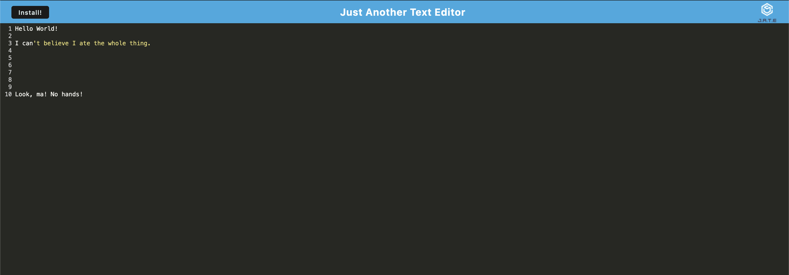

# Just Another Excellent Text Editor
  
  

  ## Description

  **My whole class did this together as a group. We all essentially have the same code.**

  This is a downloadable text editor app that uses PWA, Lighthouse, webpack, service workers, indexedDB, babel, and manifest. Here is how the app looks while deployed on heroku:

  

  ### Table of Contents

  * [Installation](#installation)
  * [Usage](#usage)
  * [Contribution Guidelines](#contribution-guidelines)
  * [Tests](#tests)
  * [Questions](#questions)
  

  ## Installation

  https://just-another-excellent-text.herokuapp.com/

  After loading the heroku instance, you can click the "install" button (does not work in firefox) in the upper left-hand corner to install onto your device. 

  ## Usage

  Text editing, take notes, you know... whatever.

  ## Contribution Guidelines

  Submit bug or feature requests

  ## Questions

  If you have any questions, you may contact me at: 

  * Github: https://github.com/anguswaffle
  * Email: aidan.bachtell@gmail.com

  ---

  ## License 

  Licensed under [MIT License](https://opensource.org/licenses/MIT). 
